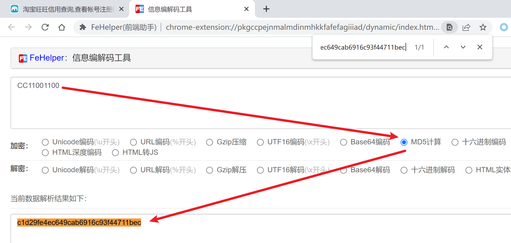

淘大象信用查询页面：

```
https://taodaxiang.com/credit2
```


查询的时候有个sign参数：


查看调用栈：


上面和下面的是jQuery内部的方法，就中间这三个看起来是网站开发者自己写的代码，挨个点进去看一下，发现在run这个方法里应该就是调用发送请求的方法：


关键在于这一行：

```js
sign = md5o(sign);
```

在这一行打个断点，重新提交：


重点在于这几行：

```js
var k = "7176a337dffebf0ff2d30d65fda5af78";
var sign0 = md5o(account + k + account + thread.type);
var sign = "";
for (var ii = 0; ii < 32; ii++) {
    sign += ((k.charCodeAt(ii) + k.charCodeAt(ii) * k.charCodeAt(ii) % 32 + sign0.charCodeAt(ii) + ii * ii) % 9);
}

sign = md5o(sign);
```

这有两个地方都调用了md5o方法，看起来像是个MD5方法，来验证一下：


然后用标准的MD5方法把`CC11001100`MD5一下：



好了现在可以确定md5o就是把传入的字符串做md5了，接下来继续看，下面是带注释版本的：

```js
// 固定的 
var k = "7176a337dffebf0ff2d30d65fda5af78";
// thread.type固定为"0"
var sign0 = md5o(account + k + account + thread.type);
var sign = "";
// 进行了一个简单的变换 
for (var ii = 0; ii < 32; ii++) {
    sign += ((k.charCodeAt(ii) + k.charCodeAt(ii) * k.charCodeAt(ii) % 32 + sign0.charCodeAt(ii) + ii * ii) % 9);
}
// 然后做md5，就是最终的sign了
sign = md5o(sign);
```


